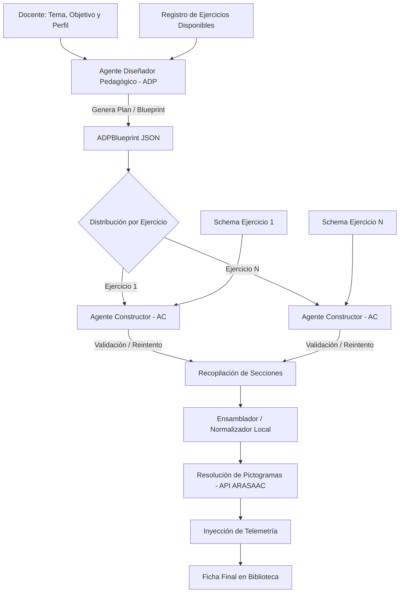

# Pictalia

Aplicación web para generar, editar y organizar fichas educativas con apoyo visual para alumnado con TEA.

## Requisitos

- Node.js 18 o superior
- npm
- Opcional: Ollama si quieres usar modelo local

## Instalación

```bash
npm install
```

## Ejecutar en desarrollo

```bash
npm run dev
```

La aplicación arranca normalmente en:

```text
http://localhost:5173
```

## Build de producción

```bash
npm run build
```

## Preview del build

```bash
npm run preview
```

## Configuración dentro de la app

Toda la configuración se hace desde la vista `Perfil`.

### Proveedor de IA

Puedes usar un solo proveedor activo a la vez:

- `Gemini API`
  - Configura `API key`
  - Configura el modelo, por ejemplo `gemini-2.5-flash`
- `Ollama local`
  - Configura la URL base, por defecto `http://localhost:11434`
  - Configura el modelo, por defecto `gemma4:e4b`

### Proveedor de pictogramas

Puedes cambiar entre:

- `ARASAAC oficial`
- `API privada`

La app ya está preparada para usar una API privada compatible con búsqueda de pictogramas.

## Uso básico

### Generar una ficha

1. Ve a `Generar Ficha`
2. Escribe el tema
3. Pulsa `Generar`

### Editar una ficha guardada

1. Ve a `Biblioteca`
2. Selecciona una ficha
3. Pulsa `Editar`
4. Haz clic sobre los pictogramas para cambiarlos
5. Usa el botón flotante del asistente IA para pedir cambios

## Logs de desarrollo

Cuando ejecutas `npm run dev`, la app muestra logs útiles para depurar:

- llamadas al proveedor de IA
- prompt enviado
- respuesta cruda del modelo
- búsquedas de pictogramas
- fases del proceso de generación

Las llamadas de IA en desarrollo pasan por un endpoint interno de Vite para que puedas ver esos logs en la terminal.

## Catálogo de ejercicios

Los tipos de ejercicio viven centralizados en `services/exerciseRepository.ts`.

Actualmente el catálogo incluye:

- `repasar`
- `unir`
- `rodear`
- `copiar`

Cada tipo define su etiqueta, instrucción por defecto, layout canónico, términos de inferencia y plantilla inicial. Esta estructura prepara el proyecto para que más adelante un docente pueda generar nuevas plantillas o ejercicios con ayuda de IA sin dispersar la lógica por componentes, normalizadores y prompts.

## Sistema Multiagente (MAS)

La generación de fichas está gobernada por una tubería multiagente estructurada (ADP Agent + AC Agents) para asegurar consistencia pedagógica y robustez de código.



Para una descripción detallada orientada a publicaciones científicas, consulta la [Documentación del Sistema Multiagente (MAS)](file:///Users/calitor/Documents/projects/Adaptator-TEA/docs/MAS_README.md).

## Notas

- La app no bloquea el arranque si falta configuración de IA.
- Si el proveedor seleccionado no está bien configurado, fallarán solo las acciones de IA.
- Para usar Ollama desde el navegador, el endpoint debe ser accesible desde tu máquina y permitir el origen si aplica.
- La antigua adaptación de PDF se ha retirado. El futuro flujo de traducción de pictogramas a texto debe implementarse como una vista nueva y separada.
