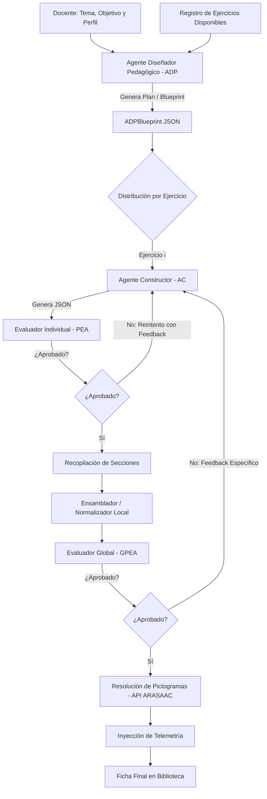

# Documentación del Sistema Multiagente (MAS) — Adaptator-TEA

Esta documentación describe la arquitectura, el flujo de trabajo, la fundamentación técnica y las estrategias de mitigación de fallos del **Sistema Multiagente (MAS)** de **Adaptator-TEA**, diseñado para automatizar y personalizar la generación de materiales educativos visualmente adaptados para alumnado con Trastorno del Espectro Autista (TEA).

El diseño de este sistema ha sido estructurado para servir como base conceptual y técnica para publicaciones científicas (*papers*) en las áreas de Inteligencia Artificial Aplicada, Accesibilidad Cognitiva y Tecnología Educativa.

---

## 1. Introducción y Motivación

La creación de materiales educativos para estudiantes con TEA exige una alta personalización. Cada ficha de trabajo debe alinearse con:
1. **El perfil cognitivo y de comunicación del alumno:** Nivel de lectura, capacidad de atención visual, necesidades de apoyo pictográfico y motricidad.
2. **Los objetivos pedagógicos del docente:** Conceptos específicos a trabajar (lectoescritura, matemáticas, discriminación visual).
3. **Estructuras visuales estables:** Formatos y layouts predecibles que reduzcan la sobrecarga cognitiva (ejercicios de repasar, unir, rodear o copiar).

### El problema de la generación por prompt único (*Single-Prompt*)
Los enfoques tradicionales donde un único prompt solicita al LLM generar una ficha completa sufren de importantes limitaciones:
* **Deriva del modelo (Drift):** El modelo a menudo mezcla reglas de formato técnico (JSON) con decisiones pedagógicas, lo que provoca fallas en la estructura del código.
* **Falta de modularidad:** No es posible validar o regenerar de forma aislada una sola sección que no cumpla con los requisitos.
* **Layouts inconsistentes:** Los modelos tienden a inventar actividades libres que no respetan el catálogo formal de ejercicios de la plataforma.

### Solución: Arquitectura Multiagente (MAS)
Para solucionar esto, **Adaptator-TEA** introduce un sistema multiagente que divide el proceso de diseño en roles independientes mediante contratos estructurados, incorpora agentes evaluadores redundantes y finaliza con una fase de ensamblaje determinista y resolución visual por API.

---

## 2. Arquitectura General y Flujo de Trabajo

El flujo de generación de fichas está dividido en etapas secuenciales con interfaces bien definidas (contratos JSON), paralelización y validación dual (Individual y Global):



---

## 3. Componentes Nucleares del MAS

El sistema se compone de agentes basados en LLM que actúan de manera coordinada y una serie de servicios de apoyo deterministas.

### 3.1. Agente Diseñador Pedagógico (ADP)
* **Archivo fuente:** [`adpAgent.ts`](file:///Users/calitor/Documents/projects/Adaptator-TEA/services/multiagent/agents/adpAgent.ts)
* **Prompt constructor:** [`adpBlueprintPrompt.ts`](file:///Users/calitor/Documents/projects/Adaptator-TEA/services/multiagent/prompts/adpBlueprintPrompt.ts)
* **Objetivo:** Actuar como el estratega educativo. Lee el perfil clínico/pedagógico del alumno, el tema curricular y decide qué secuencia de ejercicios y qué objetivos específicos son los más adecuados para evitar la fatiga cognitiva del estudiante.

#### Entradas del ADP:
* **Perfil del alumno:** Texto libre o estructurado que describe las fortalezas y adaptaciones requeridas (por ejemplo, si prefiere apoyo visual completo, si sabe escribir palabras o si solo discrimina letras).
* **Objetivos pedagógicos (Contexto):** El tema de la ficha (*"Los animales de la selva"*), el objetivo (*"identificar carnívoros"*) e indicaciones adicionales.
* **Catálogo de ejercicios disponibles y Restricciones Estructurales:** El listado dinámico de tipos de ejercicios soportados por el frontend (obtenido a través de [`registry.ts`](file:///Users/calitor/Documents/projects/Adaptator-TEA/components/exercises/registry.ts)). Junto con la descripción pedagógica, el prompt del ADP importa de forma dinámica los `promptRules` definidos en el manifest de cada componente de ejercicio (ej: [`manifest.ts` de rodear](file:///Users/calitor/Documents/projects/Adaptator-TEA/components/exercises/circling/manifest.ts), [`manifest.ts` de unir](file:///Users/calitor/Documents/projects/Adaptator-TEA/components/exercises/matching/manifest.ts)). De esta forma, las restricciones de layout físico se propagan directamente desde sus componentes específicos sin acoplamiento duro en el MAS. Esto previene que el agente estratega invente interfaces o diagramas complejos no soportados (como ilustraciones del cuerpo humano con sub-opciones).
* **Cantidad de ejercicios:** Si el docente solicita un número concreto, se le exige respetarlo; de lo contrario, estima una cantidad razonable (entre 3 y 5 ejercicios) según la fatiga cognitiva deducida del perfil del alumno.

#### Salida del ADP (`ADPBlueprint`):
Un plan estructurado de ficha que no contiene el contenido de los ejercicios, sino solo la estrategia pedagógica de cada uno:
```json
{
  "title": "Ficha sobre los animales de la selva",
  "pictogramSearchTerm": "selva",
  "exercisePlans": [
    {
      "type": "repasar",
      "objective": "Introducción visual al vocabulario clave de la selva",
      "instruction": "REPASAR LA PALABRA Y OBSERVAR EL DIBUJO",
      "description": "Repaso del nombre de 3 animales de la selva: LEÓN, TIGRE y MONO. Se mostrarán en trazos para repasar."
    },
    {
      "type": "rodear",
      "objective": "Discriminación visual de animales carnívoros",
      "instruction": "RODEAR LOS ANIMALES QUE COMEN CARNE",
      "description": "Presentar un león, una jirafa, un elefante y un jaguar. El alumno debe rodear el león y el jaguar."
    }
  ]
}
```

---

### 3.2. Agente Constructor de Ejercicios (AC)
* **Archivo fuente:** [`acAgent.ts`](file:///Users/calitor/Documents/projects/Adaptator-TEA/services/multiagent/agents/acAgent.ts)
* **Prompt constructor:** [`acExercisePrompt.ts`](file:///Users/calitor/Documents/projects/Adaptator-TEA/services/multiagent/prompts/acExercisePrompt.ts)
* **Objetivo:** Actuar como el implementador técnico. Su única tarea es recibir un plan de ejercicio individualizado creado por el ADP y transformarlo en un objeto estructurado JSON que cumpla estrictamente con el esquema del tipo de ejercicio solicitado.

#### Ejecución Paralela y Aislamiento:
A diferencia de los modelos monolíticos, si una ficha consta de 4 ejercicios, se lanzan 4 ejecuciones independientes del **AC** en paralelo. Esto presenta ventajas claras:
1. **Eficiencia temporal:** La generación de la ficha es mucho más rápida al paralelizar las llamadas a la API de inferencia.
2. **Aislamiento de errores:** Si un ejercicio falla en su formato JSON o esquema estructural, solo se reintenta ese ejercicio en particular, reduciendo el coste de tokens y evitando la corrupción de los demás ejercicios correctos.
3. **Foco del modelo:** Al procesar un único ejercicio a la vez, el LLM no sufre la pérdida de atención característica de los contextos largos, generando contenidos más ricos y alineados con las instrucciones de formato.

---

### 3.3. Sistema de Evaluación Dual (PEA + GPEA)
Para garantizar la máxima calidad técnica y pedagógica, la tubería de agentes incorpora un sistema de validación dual automatizado compuesto por dos roles evaluadores:

#### 3.3.1. Evaluador Individual (PEA - Pedagogical Evaluator Agent)
* **Archivo fuente:** [`evaluatorAgent.ts`](file:///Users/calitor/Documents/projects/Adaptator-TEA/services/multiagent/agents/evaluatorAgent.ts)
* **Prompt constructor:** [`individualEvaluatorPrompt.ts`](file:///Users/calitor/Documents/projects/Adaptator-TEA/services/multiagent/prompts/individualEvaluatorPrompt.ts)
* **Funcionamiento:** Inmediatamente después de que el AC genera un ejercicio, el PEA lo audita contra el plan de ese ejercicio concreto y el perfil del estudiante.
* **Criterios de evaluación:** Corrección conceptual (sintaxis JSON), correspondencia semántica con el plan (si el plan pide emparejar letras, evalúa que haya letras y no números) e idoneidad de la complejidad del lenguaje para el alumno.
* **Bucle de retroalimentación (Feedback Loop):** Si el PEA detecta un fallo, devuelve `"approved": false` junto con una instrucción en `"feedback"`. El sistema interrumpe el flujo de ese ejercicio y re-invoca al AC pasando este feedback específico como entrada correctora (hasta un máximo de 3 intentos).

#### 3.3.2. Evaluador Global (GPEA - Global Pedagogical Evaluator Agent)
* **Archivo fuente:** [`evaluatorAgent.ts`](file:///Users/calitor/Documents/projects/Adaptator-TEA/services/multiagent/agents/evaluatorAgent.ts)
* **Prompt constructor:** [`globalEvaluatorPrompt.ts`](file:///Users/calitor/Documents/projects/Adaptator-TEA/services/multiagent/prompts/globalEvaluatorPrompt.ts)
* **Funcionamiento:** Tras consolidar todos los ejercicios aprobados individualmente en una ficha estructurada preliminar, el GPEA analiza la ficha como un conjunto indivisible.
* **Criterios de evaluación:** Progresión de dificultad lógica (ej. actividades de repaso antes que copias complejas), redundancia o duplicidades de términos a lo largo de la ficha, y volumen de carga cognitiva global para el nivel de atención del alumno.
* **Flujo de corrección selectiva:** Si la ficha presenta deficiencias globales, el GPEA devuelve `"approved": false` acompañado de una lista de `exerciseModifications` que indica qué ejercicio(s) causan el desajuste (especificando su índice) y el feedback corrector. El sistema activa la regeneración secuencial de *únicamente* los ejercicios señalados, volviendo a pre-ensamblar y re-evaluar la ficha de manera global (máximo 2 intentos globales).

---

### 3.4. Ensamblador de Fichas (Código Determinista)
Una vez que todas las promesas del **AC** se resuelven con éxito, el flujo pasa a código puro (TypeScript en el cliente):
1. **Normalización:** El archivo [`worksheetNormalizer.ts`](file:///Users/calitor/Documents/projects/Adaptator-TEA/services/worksheetNormalizer.ts) toma las secciones individuales generadas por los AC y las unifica bajo la estructura global `Worksheet`.
2. **Inyección de Layouts Canónicos:** Deriva el layout visual adecuado de manera determinista (por ejemplo, la actividad de tipo `unir` se fuerza a un layout `matching_horizontal`, y la de `repasar` a un layout vertical `column`). Esto impide que el LLM proponga interfaces imposibles de renderizar.
3. **Asignación de Identificadores Únicos (UUIDs):** Asigna de forma segura los IDs requeridos por React para el renderizado del DOM de manera unívoca.

---

### 3.5. Resolutor de Pictogramas (API ARASAAC / API Privada)
Una vez normalizada la estructura lingüística de la ficha, se identifican en paralelo todos los términos semánticos candidatos a poseer apoyo pictográfico:
1. El término temático principal de la cabecera.
2. Los pictogramas asociados a las instrucciones escritas (ej: "RODEAR", "ASOCIAR").
3. Los conceptos visuales dentro de cada ejercicio (ej: imágenes de animales, términos enlazados).

El sistema lanza una batería de peticiones concurrentes a la API de pictogramas (ARASAAC oficial o la API privada configurada). El API devuelve una lista de opciones visuales y el sistema preselecciona la opción con mayor coincidencia. El docente puede después redefinir estas opciones manualmente desde la interfaz de edición de la biblioteca de la aplicación.

---

## 4. Gestión y Mitigación de Alucinaciones

El fenómeno de las alucinaciones en modelos de lenguaje (LLMs) es combatido en **Adaptator-TEA** mediante una estrategia de defensa en capas:

| Capa de Defensa | Tipo de Alucinación | Mecanismo de Mitigación | Fichero Asociado |
| :--- | :--- | :--- | :--- |
| **Esquema Estricto** | Estructural (JSON inválido, campos inventados) | Uso de interfaces TypeScript rígidas y esquemas JSON integrados en el prompt del constructor. | [`registry.ts`](file:///Users/calitor/Documents/projects/Adaptator-TEA/components/exercises/registry.ts) |
| **Evaluador Individual** | Pedagógica (desviación de instrucciones, complejidad excesiva) | El PEA compara el resultado del constructor directamente con la directriz original y perfil del estudiante. | [`individualEvaluatorPrompt.ts`](file:///Users/calitor/Documents/projects/Adaptator-TEA/services/multiagent/prompts/individualEvaluatorPrompt.ts) |
| **Evaluador Global** | De Contexto (redundancias cognitivas, desorden temático) | El GPEA audita la coherencia colectiva y la fatiga visual de la ficha consolidada. | [`globalEvaluatorPrompt.ts`](file:///Users/calitor/Documents/projects/Adaptator-TEA/services/multiagent/prompts/globalEvaluatorPrompt.ts) |
| **Regla de Palabra Única** | Fallos de Búsqueda de Pictogramas (frases o sufijos) | Directriz estricta inyectada en el AC y auditada por el PEA/GPEA que exige que "searchTerm" y "content" de cada pictograma contengan una única palabra y prohíbe guiones, guiones bajos o sufijos como "_pictograma". | [`blocks.ts`](file:///Users/calitor/Documents/projects/Adaptator-TEA/services/prompts/blocks.ts) |
| **Reparadores Rápidos** | De Sintaxis o Contenido Crítico | Sub-prompts dedicados a corregir JSONs rotos o secciones incompletas/fuera de tema antes de lanzar fallos al sistema. | [`jsonRepairPrompt.ts`](file:///Users/calitor/Documents/projects/Adaptator-TEA/services/multiagent/prompts/jsonRepairPrompt.ts) |
| **Normalizador Determinista** | Visual (layouts no soportados, IDs corruptos) | Código imperativo local que anula cualquier propuesta de layout o metadatos de la IA, sobreescribiéndolos con constantes predefinidas. | [`worksheetNormalizer.ts`](file:///Users/calitor/Documents/projects/Adaptator-TEA/services/worksheetNormalizer.ts) |

### 4.1. Regla de Palabra Única para Pictogramas (Mitigación para LLMs Open Source)
Los modelos de código abierto (*open source*) o locales de menor tamaño suelen presentar dificultades al asociar palabras con pictogramas de la API (ARASAAC), tendiendo a alucinar descripciones extensas (ej. `"el niño corriendo en el parque"`) o sufijos calificadores (ej. `"mango_pictograma"`) en lugar de términos de búsqueda simples. Para mitigar esto:
1. **Inyección en Prompt del Constructor (AC):** Se inyectan las reglas de `PICTOGRAM_RULES` en [acExercisePrompt.ts](file:///Users/calitor/Documents/projects/Adaptator-TEA/services/multiagent/prompts/acExercisePrompt.ts), forzando a que `"content"` y `"searchTerm"` sean siempre una **única palabra** (ej. `"correr"` o `"niño"`) y prohibiendo de forma explícita el uso de guiones bajos, guiones o sufijos técnicos como `_pictograma` o `_image`.
2. **Filtrado en los Evaluadores (PEA/GPEA):** Los prompts de evaluación individual y global auditan activamente la longitud y caracteres de los términos de los pictogramas. Si se detecta una frase de múltiples palabras, un término con guiones bajos o sufijos calificados, el evaluador emite un rechazo pedagógico e indica el índice del ejercicio para su corrección automática con retroalimentación específica.


---

## 5. Mecanismos de Reparación ante Fallos Estructurales

Además del bucle de reintento en el AC, la capa de servicios en [`aiService.ts`](file:///Users/calitor/Documents/projects/Adaptator-TEA/services/aiService.ts) incluye prompts dedicados de rescate y reparación semántica:

### 5.1. Reparación de Formato JSON (JSON Repair Loop)
* **Prompt:** [`jsonRepairPrompt.ts`](file:///Users/calitor/Documents/projects/Adaptator-TEA/services/multiagent/prompts/jsonRepairPrompt.ts)
* **Uso:** Si el resultado crudo del modelo contiene texto conversacional o caracteres no válidos que impiden el parseo JSON, este prompt aislado toma la salida defectuosa, el mensaje del error de sintaxis del parser, y le exige al LLM que limpie la respuesta de forma estricta, devolviendo únicamente el objeto JSON corregido.

### 5.2. Reparación de Desviación Semántica (Semantic Repair Loop)
* **Prompt:** [`semanticRepairPrompt.ts`](file:///Users/calitor/Documents/projects/Adaptator-TEA/services/multiagent/prompts/semanticRepairPrompt.ts)
* **Uso:** Valida si el contenido de la ficha generada ha derivado hacia temas no relacionados con la petición original del docente o si introduce contenidos demasiado genéricos. Si detecta esta discrepancia, re-inyecta el perfil del alumno y la temática obligando a una reestructuración enfocada en el dominio.

### 5.3. Reparación por Falta de Ejercicios (Exercise Count Repair Loop)
* **Prompt:** [`exerciseCountRepairPrompt.ts`](file:///Users/calitor/Documents/projects/Adaptator-TEA/services/multiagent/prompts/exerciseCountRepairPrompt.ts)
* **Uso:** Si tras la ejecución la ficha cuenta con menos ejercicios de los solicitados por el docente, este prompt toma la ficha incompleta y añade las secciones faltantes preservando el estilo pedagógico de las anteriores sin alterar los ejercicios correctos ya generados.

---

## 6. Telemetría e Indicadores de Rendimiento

El sistema MAS encapsula una capa de telemetría que registra el comportamiento de la tubería de agentes en cada generación:

```typescript
worksheet.telemetry = {
  generationTimeMs: totalTimeMs,  // Tiempo total consumido por el pipeline
  adpTimeMs,                     // Tiempo consumido por el Agente Diseñador Pedagógico
  acTimeMs,                      // Tiempo de generación concurrente de los Agentes Constructores
  rejectionCount: 0,             // Rechazos por validación
  manualEditsCount: 0,           // Cambios manuales realizados a posteriori por el docente
  pictoOverridesCount: 0,        // Pictogramas personalizados por el docente
  retryCount,                    // Número de reintentos de autocuración aplicados
  createdTimestamp: new Date().toISOString(),
};
```

Esta telemetría permite recopilar datos de rendimiento del sistema bajo diferentes LLMs (por ejemplo, comparando el rendimiento y tasa de reintento entre modelos comerciales como Gemini API y modelos locales en Ollama como Gemma).

---

## 7. Contribuciones Técnicas Clave para la Literatura Científica

De cara a la redacción del *paper*, este sistema MAS aporta las siguientes contribuciones:

1. **Separación de Decisiones Pedagógicas y Contenido Estructural:** Demuestra cómo desacoplar el diseño curricular (ADP) de la construcción gramatical y de datos (AC) mejora la coherencia educativa de las fichas adaptadas.
2. **Registro Dinámico de Herramientas y Ejercicios (Dynamically Registered Workspaces):** Los agentes no están acoplados rígidamente a los tipos de ejercicio actuales (`repasar`, `unir`, `rodear`, `copiar`). El sistema lee las descripciones pedagógicas y los esquemas JSON de los ejercicios en caliente desde el catálogo de componentes. Esto permite extender la plataforma con nuevas actividades sin modificar las directrices de los agentes de IA.
3. **Validación Dual Asíncrona-Secuencial:** Describe un framework donde se combinan evaluaciones aisladas en paralelo (PEA) para maximizar la velocidad y modularidad, con una evaluación sintética global (GPEA) para controlar la progresión del aprendizaje y la fatiga cognitiva del estudiante.
4. **Resiliencia mediante Reparación Focalizada:** Propone un flujo donde los fallos colectivos se resuelven mediante regeneraciones aisladas sobre el componente conflictivo basándose en retroalimentación estructurada del evaluador, evitando así el desperdicio de tokens de una re-generación completa del documento.
5. **Hibridación Determinista-Generativa para Accesibilidad Cognitiva:** Integra LLMs estocásticos para la contextualización temática y pedagógica junto con normalizadores deterministas y APIs externas estructuradas (ARASAAC) para garantizar la solidez final en entornos de educación especial.

---

## 8. Modo Alternativo: Prompt Único (Single-Prompt)

Para permitir estudios comparativos (esenciales en la evaluación del paper de investigación), la plataforma dispone de un interruptor de **Prompt Único** (*Single-Prompt*) en el panel de **Configuración Técnica**.

Cuando este modo está activo:
1. **Bypass del MAS:** Se salta toda la orquestación multiagente (ADP, AC, PEA, GPEA).
2. **Construcción Unificada:** Se genera un único prompt consolidado que combina:
   - El perfil de estudiante completo (datos clínicos y pedagógicos).
   - El tema curricular y objetivos solicitados.
   - El catálogo dinámico de ejercicios cargando sus reglas estructurales, limitaciones físicas de diseño y esquemas JSON directamente desde sus respectivos componentes modulares.
   - Las reglas estrictas de palabras únicas para los pictogramas.
   - Las pautas pedagógicas de adaptación general y un ejemplo completo de ficha (few-shot).
3. **Ejecución y Autocuración:** Se realiza una única llamada a la API de inferencia. Si el formato JSON está corrompido, se aplica el bucle aislado de reparación de sintaxis JSON (`repairJsonResponse`).
4. **Ensamblado y Telemetría:** El documento resultante fluye a través del normalizador determinista y el resolvedor de pictogramas concurrente. En la telemetría, el tiempo de ADP (`adpTimeMs`) y AC (`acTimeMs`) se registran como `0`, permitiendo medir de forma limpia la diferencia de latencia y tasa de fallos frente al pipeline MAS.

---

## 9. Suite de Evaluación Científica y Benchmarking

Para simplificar la recopilación de datos experimentales del *paper*, hemos diseñado un framework de benchmarking automatizado en la carpeta `scripts/`. Este framework permite ejecutar de forma masiva **50 tareas pedagógicas de prueba** bajo diferentes combinaciones de modelos, perfiles de estudiante y modos de generación, recolectando métricas empíricas de forma objetiva.

### Componentes de la Suite:

1. **`scripts/tasks.json`:** Contiene 50 casos de prueba realistas que cubren temas cotidianos, matemáticos, lingüísticos, conductuales y de psicomotricidad fina, junto con sus objetivos y exclusiones de diseño solicitadas por el docente (detalles adicionales).
2. **`scripts/student_profiles.json`:** Define 3 niveles de soporte clínico (Alto, Medio/Base y Bajo) con diferentes descripciones pedagógicas y necesidades de adaptación de pictogramas para verificar la adaptabilidad del volumen.
3. **`scripts/generator/` (Paquete Python Modular):** Módulo nativo en Python que replica de manera idéntica el comportamiento, prompts y flujo del Multi-Agent System (ADP -> AC -> PEA -> GPEA) y del Single-Prompt, permitiendo su ejecución sin dependencias de Node.js o JavaScript (ideal para clusters HPC o entornos SLURM).
4. **`scripts/evaluate.py`:** El orquestador principal en Python.
   - Ejecuta las corridas de benchmark de forma asíncrona y segura ante fallos (cualquier excepción se captura, se registra en el reporte CSV y se continúa con el lote).
   - Genera una traza de depuración en `scripts/generated_worksheets/run_*.json` conteniendo la información de la corrida, el historial cronológico de todas las llamadas e inputs/outputs de la IA (`llm_calls`), y la estructura final de la ficha (`final_worksheet`).
   - Evalúa la calidad analizando alucinaciones de pictogramas e incumplimiento de exclusiones.
   - Exporta el resumen consolidado a `scripts/evaluation_summary.json` y los indicadores a `scripts/evaluation_results.csv`.
5. **Visualizador de Corridas Multi-Página (`visualizer.html`):** Una aplicación React/Vite independiente que utiliza los mismos componentes de renderizado gráfico de la plataforma (`WorksheetDisplay`, etc.) para renderizar de manera fidedigna el resultado de las corridas.

### Instrucciones de Uso:

1. **Instalar Dependencias de Python:**
   ```bash
   pip install -r scripts/requirements.txt
   ```

2. **Ejecutar el Benchmark:**
   Puedes configurar las pruebas pasando variables de entorno o argumentos CLI. Por ejemplo, para probar las primeras 5 tareas en ambos modos usando la API de Gemini:
   ```bash
   export GEMINI_API_KEY="tu_clave_api"
   python scripts/evaluate.py --tasks-limit 5 --provider gemini --modes single,multi --gemini-model gemini-1.5-flash
   ```

3. **Ejecutar con Ollama Local:**
   Asegúrate de tener el servidor de Ollama corriendo en `http://localhost:11434` con el modelo descargado (ej: `gemma3:4b`):
   ```bash
   python scripts/evaluate.py --tasks-limit 5 --provider ollama --modes single,multi --ollama-model gemma3:4b
   ```

4. **Visualizar las Fichas y Trazas (Dashboard React Standalone):**
   - Inicia el servidor de desarrollo de Vite (si no está ya activo):
     ```bash
     npm run dev
     ```
   - Entra en tu navegador en la URL: **`http://localhost:5173/visualizer.html`**.
   - Haz clic en **"Subir Archivos"**, **"Cargar Carpeta"** (selecciona `scripts/generated_worksheets/`), o arrastra archivos `.json` directamente sobre el dropzone de la barra lateral.
   - Selecciona cualquier corrida cargada para:
     - Ver una **previsualización idéntica y fidedigna en papel** de la ficha generada, utilizando los componentes reales de React (`WorksheetDisplay`).
     - Auditar el **historial cronológico de llamadas de los agentes** de la IA (prompts y respuestas).
     - Consultar el **JSON crudo completo**.
     - Auto-recarga: las corridas cargadas de la carpeta se sincronizan con las que se completan en la suite de benchmark.

