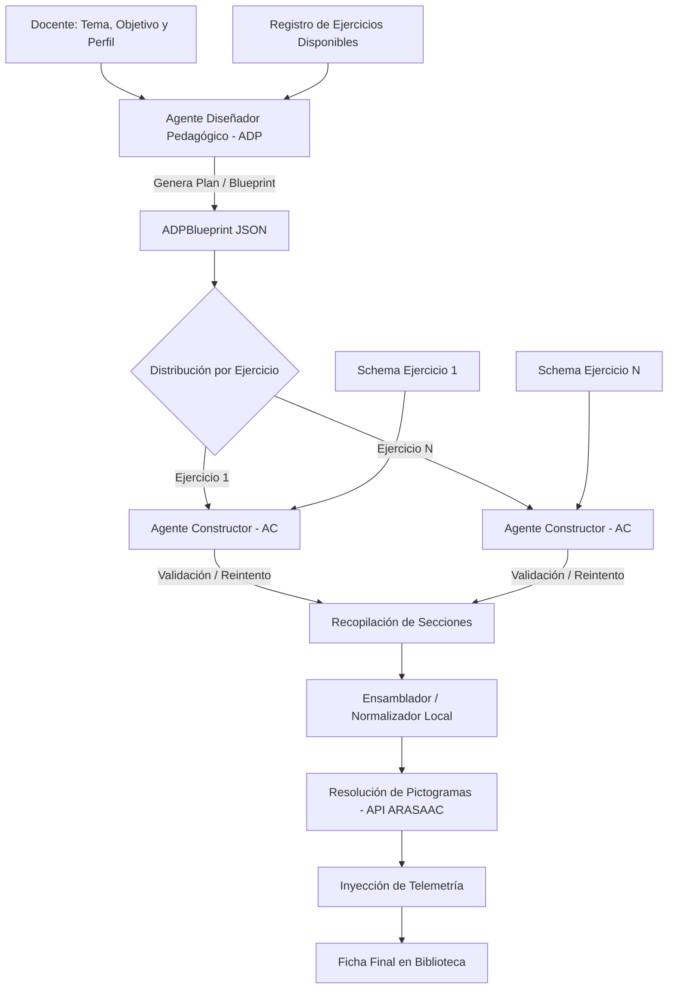

# Documentación del Sistema Multiagente (MAS) — Adaptator-TEA

Esta documentación describe la arquitectura, el flujo de trabajo y la fundamentación técnica del **Sistema Multiagente (MAS)** de **Adaptator-TEA**, diseñado para automatizar y personalizar la generación de materiales educativos visualmente adaptados para alumnado con Trastorno del Espectro Autista (TEA).

El diseño de este sistema ha sido estructurado para servir como base conceptual y técnica para publicaciones científicas (*papers*) en las áreas de Inteligencia Artificial Aplicada, Accesibilidad Cognitiva y Tecnología Educativa.

---

## 1. Introducción y Motivación

La creación de materiales educativos para estudiantes con TEA exige una alta personalización. Cada ficha de trabajo debe alinearse con:
1. **El perfil cognitivo y de comunicación del alumno:** Nivel de lectura, capacidad de atención visual, necesidades de apoyo pictográfico y motricidad.
2. **Los objetivos pedagógicos del docente:** Conceptos específicos a trabajar (lectoescritura, matemáticas, discriminación visual).
3. **Estructuras visuales estables:** Formatos y layouts predecibles que reduzcan la sobrecarga cognitiva (ejercicios de repasar, unir, rodear o copiar).

### El problema de la generación por prompt único (*Single-Prompt*)
Los enfoques tradicionales donde un único prompt solicita al LLM generar una ficha completa sufren de importantes limitaciones:
* **Deriva del modelo (Drift):** El modelo a menudo mezcla reglas de formato técnico (JSON) con decisiones pedagógicas, lo que provoca fallas en la estructura del código.
* **Falta de modularidad:** No es posible validar o regenerar de forma aislada una sola sección que no cumpla con los requisitos.
* **Layouts inconsistentes:** Los modelos tienden a inventar actividades libres que no respetan el catálogo formal de ejercicios de la plataforma.

### Solución: Arquitectura Multiagente (MAS)
Para solucionar esto, **Adaptator-TEA** introduce un sistema multiagente que divide el proceso de diseño en dos roles independientes mediante contratos estructurados, seguidos de una fase de ensamblaje determinista y resolución visual por API.

---

## 2. Arquitectura General y Flujo de Trabajo

El flujo de generación de fichas está dividido en etapas secuenciales con interfaces bien definidas (contratos JSON) y paralelización:



---

## 3. Componentes Nucleares del MAS

El sistema se compone de dos agentes basados en LLM que actúan de manera coordinada y una serie de servicios de apoyo deterministas.

### 3.1. Agente Diseñador Pedagógico (ADP)
* **Archivo fuente:** [`adpAgent.ts`](file:///Users/calitor/Documents/projects/Adaptator-TEA/services/multiagent/agents/adpAgent.ts)
* **Prompt constructor:** [`adpBlueprintPrompt.ts`](file:///Users/calitor/Documents/projects/Adaptator-TEA/services/multiagent/prompts/adpBlueprintPrompt.ts)
* **Objetivo:** Actuar como el estratega educativo. Lee el perfil clínico/pedagógico del alumno, el tema curricular y decide qué secuencia de ejercicios y qué objetivos específicos son los más adecuados para evitar la fatiga cognitiva del estudiante.

#### Entradas del ADP:
* **Perfil del alumno:** Texto libre o estructurado que describe las fortalezas y adaptaciones requeridas (por ejemplo, si prefiere apoyo visual completo, si sabe escribir palabras o si solo discrimina letras).
* **Objetivos pedagógicos (Contexto):** El tema de la ficha (*"Los animales de la selva"*), el objetivo (*"identificar carnívoros"*) e indicaciones adicionales.
* **Catálogo de ejercicios disponibles:** El listado dinámico de tipos de ejercicios soportados por el frontend (obtenido a través de [`registry.ts`](file:///Users/calitor/Documents/projects/Adaptator-TEA/components/exercises/registry.ts)), cada uno con su descripción pedagógica asociada para que la IA sepa cuándo y por qué elegirlo.
* **Cantidad de ejercicios:** Si el docente solicita un número concreto, se le exige respetarlo; de lo contrario, estima una cantidad razonable (entre 3 y 5 ejercicios) según la fatiga cognitiva deducida del perfil del alumno.

#### Salida del ADP (`ADPBlueprint`):
Un plan estructurado de ficha que no contiene el contenido de los ejercicios, sino solo la estrategia pedagógica de cada uno:
```json
{
  "title": "Ficha sobre los animales de la selva",
  "pictogramSearchTerm": "selva",
  "exercisePlans": [
    {
      "type": "repasar",
      "objective": "Introducción visual al vocabulario clave de la selva",
      "instruction": "REPASAR LA PALABRA Y OBSERVAR EL DIBUJO",
      "description": "Repaso del nombre de 3 animales de la selva: LEÓN, TIGRE y MONO. Se mostrarán en trazos para repasar."
    },
    {
      "type": "rodear",
      "objective": "Discriminación visual de animales carnívoros",
      "instruction": "RODEAR LOS ANIMALES QUE COMEN CARNE",
      "description": "Presentar un león, una jirafa, un elefante y un jaguar. El alumno debe rodear el león y el jaguar."
    }
  ]
}
```

---

### 3.2. Agente Constructor de Ejercicios (AC)
* **Archivo fuente:** [`acAgent.ts`](file:///Users/calitor/Documents/projects/Adaptator-TEA/services/multiagent/agents/acAgent.ts)
* **Prompt constructor:** [`acExercisePrompt.ts`](file:///Users/calitor/Documents/projects/Adaptator-TEA/services/multiagent/prompts/acExercisePrompt.ts)
* **Objetivo:** Actuar como el implementador técnico. Su única tarea es recibir un plan de ejercicio individualizado creado por el ADP y transformarlo en un objeto estructurado JSON que cumpla estrictamente con el esquema del tipo de ejercicio solicitado.

#### Ejecución Paralela y Aislamiento:
A diferencia de los modelos monolíticos, si una ficha consta de 4 ejercicios, se lanzan 4 ejecuciones independientes del **AC** en paralelo. Esto presenta tres ventajas claras:
1. **Eficiencia temporal:** La generación de la ficha es mucho más rápida al paralelizar las llamadas a la API de inferencia.
2. **Aislamiento de errores:** Si un ejercicio falla en su formato JSON o esquema estructural, solo se reintenta ese ejercicio en particular, reduciendo el coste de tokens y evitando la corrupción de los demás ejercicios correctos.
3. **Foco del modelo:** Al procesar un único ejercicio a la vez, el LLM no sufre la pérdida de atención característica de los contextos largos, generando contenidos más ricos y alineados con las instrucciones de formato.

#### Mecanismo de Autocuración (Self-Healing / Retry Loop):
El AC cuenta con un bucle de reintento automático (hasta 3 intentos):
1. El AC recibe el plan y el esquema JSON específico del tipo de ejercicio (ej: esquema para `unir` o para `repasar`).
2. Genera la respuesta e intenta deserializarla.
3. Si el JSON está mal formado o no cumple con las propiedades críticas requeridas en el esquema del componente visual (por ejemplo, si falta el campo `exerciseType` o la instrucción), el sistema registra el fallo, emite un aviso a la telemetría e inicia una nueva llamada de corrección hasta obtener una estructura válida.

---

### 3.3. Ensamblador de Fichas (Código Determinista)
Una vez que todas las promesas del **AC** se resuelven con éxito, el flujo pasa a código puro (TypeScript en el cliente):
1. **Normalización:** El archivo [`worksheetNormalizer.ts`](file:///Users/calitor/Documents/projects/Adaptator-TEA/services/worksheetNormalizer.ts) toma las secciones individuales generadas por los AC y las unifica bajo la estructura global `Worksheet`.
2. **Inyección de Layouts Canónicos:** Deriva el layout visual adecuado de manera determinista (por ejemplo, la actividad de tipo `unir` se fuerza a un layout `matching_horizontal`, y la de `repasar` a un layout vertical `column`). Esto impide que el LLM proponga interfaces imposibles de renderizar.
3. **Asignación de Identificadores Únicos (UUIDs):** Asigna de forma segura los IDs requeridos por React para el renderizado del DOM de manera unívoca.

---

### 3.4. Resolutor de Pictogramas (API ARASAAC / API Privada)
Una vez normalizada la estructura lingüística de la ficha, se identifican en paralelo todos los términos semánticos candidatos a poseer apoyo pictográfico:
1. El término temático principal de la cabecera.
2. Los pictogramas asociados a las instrucciones escritas (ej: "RODEAR", "ASOCIAR").
3. Los conceptos visuales dentro de cada ejercicio (ej: imágenes de animales, términos enlazados).

El sistema lanza una batería de peticiones concurrentes a la API de pictogramas (ARASAAC oficial o la API privada configurada). El API devuelve una lista de opciones visuales y el sistema preselecciona la opción con mayor coincidencia. El docente puede después redefinir estas opciones manualmente desde la interfaz de edición de la biblioteca de la aplicación.

---

## 4. Mecanismos de Reparación ante Fallos Estructurales

Además del bucle de reintento en el AC, la capa de servicios en [`aiService.ts`](file:///Users/calitor/Documents/projects/Adaptator-TEA/services/aiService.ts) incluye prompts dedicados de rescate y reparación semántica:

### 4.1. Reparación de Formato JSON (JSON Repair Loop)
* **Prompt:** [`jsonRepairPrompt.ts`](file:///Users/calitor/Documents/projects/Adaptator-TEA/services/multiagent/prompts/jsonRepairPrompt.ts)
* **Uso:** Si el resultado crudo del modelo contiene texto conversacional o caracteres no válidos que impiden el parseo JSON, este prompt aislado toma la salida defectuosa, el mensaje del error de sintaxis del parser, y le exige al LLM que limpie la respuesta de forma estricta, devolviendo únicamente el objeto JSON corregido.

### 4.2. Reparación de Desviación Semántica (Semantic Repair Loop)
* **Prompt:** [`semanticRepairPrompt.ts`](file:///Users/calitor/Documents/projects/Adaptator-TEA/services/multiagent/prompts/semanticRepairPrompt.ts)
* **Uso:** Valida si el contenido de la ficha generada ha derivado hacia temas no relacionados con la petición original del docente o si introduce contenidos demasiado genéricos. Si detecta esta discrepancia, re-inyecta el perfil del alumno y la temática obligando a una reestructuración enfocada en el dominio.

### 4.3. Reparación por Falta de Ejercicios (Exercise Count Repair Loop)
* **Prompt:** [`exerciseCountRepairPrompt.ts`](file:///Users/calitor/Documents/projects/Adaptator-TEA/services/multiagent/prompts/exerciseCountRepairPrompt.ts)
* **Uso:** Si tras la ejecución la ficha cuenta con menos ejercicios de los solicitados por el docente, este prompt toma la ficha incompleta y añade las secciones faltantes preservando el estilo pedagógico de las anteriores sin alterar los ejercicios correctos ya generados.

---

## 5. Telemetría e Indicadores de Rendimiento

El sistema MAS encapsula una capa de telemetría que registra el comportamiento de la tubería de agentes en cada generación:

```typescript
worksheet.telemetry = {
  generationTimeMs: totalTimeMs,  // Tiempo total consumido por el pipeline
  adpTimeMs,                     // Tiempo consumido por el Agente Diseñador Pedagógico
  acTimeMs,                      // Tiempo de generación concurrente de los Agentes Constructores
  rejectionCount: 0,             // Rechazos por validación
  manualEditsCount: 0,           // Cambios manuales realizados a posteriori por el docente
  pictoOverridesCount: 0,        // Pictogramas personalizados por el docente
  retryCount,                    // Número de reintentos de autocuración aplicados
  createdTimestamp: new Date().toISOString(),
};
```

Esta telemetría permite recopilar datos de rendimiento del sistema bajo diferentes LLMs (por ejemplo, comparando el rendimiento y tasa de reintento entre modelos comerciales como Gemini API y modelos locales en Ollama como Gemma).

---

## 6. Contribuciones Técnicas Clave para la Literatura Científica

De cara a la redacción del *paper*, este sistema MAS aporta las siguientes contribuciones:

1. **Separación de Decisiones Pedagógicas y Contenido Estructural:** Demuestra cómo desacoplar el diseño curricular (ADP) de la construcción gramatical y de datos (AC) mejora la coherencia educativa de las fichas adaptadas.
2. **Registro Dinámico de Herramientas y Ejercicios (Dynamically Registered Workspaces):** Los agentes no están acoplados rígidamente a los tipos de ejercicio actuales (`repasar`, `unir`, `rodear`, `copiar`). El sistema lee las descripciones pedagógicas y los esquemas JSON de los ejercicios en caliente desde el catálogo de componentes. Esto permite extender la plataforma con nuevas actividades sin modificar las directrices de los agentes de IA.
3. **Resiliencia Mediante Reparaciones Aisladas en Paralelo:** El uso de agentes constructores independientes para cada sección reduce significativamente el impacto de fallos de inferencia estocástica en entornos interactivos de producción.
4. **Hibridación Determinista-Generativa:** Combina la flexibilidad de los modelos de lenguaje para contextualizar temáticas con el rigor de algoritmos locales y APIs estructuradas (ARASAAC) para garantizar la solidez final del material clínico y educativo.
